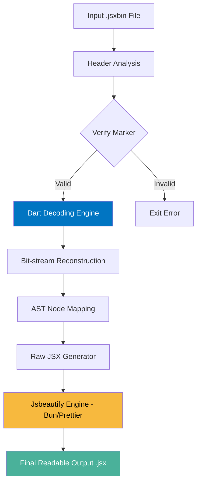

# JSXBIN to JSX Converter: High-Performance Deobfuscator & Formatter

[](https://dart.dev)
[](https://bun.sh)
[](https://prettier.io)
[](#platforms-support)

A state-of-the-art, cross-platform tool designed to de-obfuscate Adobe ExtendScript **JSXBIN** files into clean, readable **JSX** (JavaScript) source code. Engineered for speed and precision using the Dart ecosystem and a Prettier-powered formatting engine.

## Table of Contents
- [What is JSXBIN vs JSX?](#what-is-jsxbin-vs-jsx)
- [Why Use This Tool?](#why-use-this-tool)
- [How it Works: The Internal Workflow](#how-it-works-the-internal-workflow)
- [Key Features](#key-features)
- [Technical Architecture](#technical-architecture)
- [Installation & Building](#installation--building)
- [Detailed Usage Guide](#detailed-usage-guide)
- [Performance Benchmarks](#performance-benchmarks)
- [Frequently Asked Questions](#frequently-asked-questions)
- [Platforms Support](#platforms-support)
- [Support Developer](#support-developer)
- [License](#license)

---

## What is JSXBIN vs JSX?

| Feature | **JSX (JavaScript XML)** | **JSXBIN (Binary)** |
| :--- | :--- | :--- |
| **Readability** | High (Human Readable) | None (Obfuscated Binary) |
| **Editing** | Editable in any text editor | Read-only as a packed blob |
| **Purpose** | Script development and logic | Protection and distribution |
| **Format** | Plain Text JavaScript | Encoded Adobe-proprietary bit-stream |

**JSXBIN** is the obfuscated, binary format for Adobe ExtendScript. It is used across the Adobe Creative Cloud suite (Photoshop, After Effects, InDesign, Premiere Pro) to protect script intellectual property. However, it often becomes a barrier for maintenance, debugging legacy tools, or learning how complex plugins operate. This tool restores the missing link by converting the binary back to clean **JSX**.

---

## Why Use This Tool?

- **Legacy Maintenance**: Recover source code for older company plugins where the original developer is no longer available.
- **Interoperability**: Understand how third-party Adobe scripts interact with the host application's DOM to build better integrations.
- **Learning & Research**: Study industry-standard ExtendScript techniques used in successful commercial plugins.
- **CI/CD Integration**: Automatically audit or scan decoded scripts as part of a development pipeline.

---

## How it Works: The Internal Workflow

Our converter uses a dual-stage pipeline to ensure that the output is not just accurate, but meets professional coding standards.



1.  **Decoding Engine (Stage 1)**: The core Dart application handles the heavy lifting of bitwise manipulation. It identifies 50+ different node types, matches identifiers against the internal symbol table, and handles multi-byte number variants.
2.  **Formatting Engine (Stage 2)**: Raw decoded output is often "minified" or lacks logical spacing. Our wrapper binary `Jsbeautify` utilizes **Prettier** to enforce consistent style, resolve semicolons, and fix indentation.

---

## Technical Architecture

The project is split into two specialized modules:

### 1. The Core (Dart)
Located in `jsbin_conv/`. This is a native Dart application that performs the de-obfuscation.
- **ScanState**: Tracks the cursor position through the encoded bit-stream.
- **Nesting Manager**: Handles the recursive "nesting levels" found in Adobe's proprietary encoding.
- **Node Factories**: A registration system that dynamically instantiates AST nodes (Expressions, Statements, XML members) based on specific hex markers.

### 2. The Beautifier (TypeScript + Bun)
Located in `js-beautify/`. A high-speed formatting engine.
- **Bun**: Used as the runtime for near-instant startup.
- **Prettier**: The industry-standard engine used to format the final output.
- **AOT Compiled**: Bundled into a standalone binary to eliminate the need for `node_modules` in production.

---

## Key Features
- **Wide Node Support**: Handles Everything from simple `BinaryExpr` to complex E4X `XMLNamespaceExpr`.
- **Pre-Comp Detection**: Specifically tuned to handle Adobe's "Header-based Pre-Comp" logic.
- **Symbol Recovery**: Efficiently reconstructs internal IDs and variables using a virtual Symbol Table.
- **Native Performance**: Compiles to optimized machine code for your specific OS.
- **Security**: Operates 100% offline; your intellectual property never leaves your machine.

---

## Installation & Setup

You can choose between the automated installation using pre-built scripts or manually building the binaries from source.

### 1. Automated Installation (Recommended)
If you have already downloaded or generated a release bundle (`.zip`), follow these steps:

#### Unix (Linux / macOS)
```bash
# Unzip the bundle if needed
unzip jsbin-conv-linux-bundle.zip -d jsbin-conv
cd jsbin-conv

# Run the installation script
chmod +x install.sh
./install.sh
```

#### Windows (Run as Administrator)
```powershell
# Navigate to the folder containing the unzipped files
.\install.ps1
```

---

## Compilation Guide

If you wish to build the tool from source for your specific architecture, follow the instructions below.

### Auto Compilation
The provided build scripts handle the entire pipeline: fetching dependencies, compiling with optimizations (obfuscation + stripped symbols), and creating a distributable bundle.

- **Unix**: Run `./make.sh`
- **Windows**: Run `.\make.ps1` (in PowerShell)

The final artifacts will be stored in the `release/` directory.

### Manual Compilation

#### Pre-requisites
- **Dart SDK**: [Download](https://dart.dev/get-dart)
- **Bun**: [Download](https://bun.sh)

#### 1. Build Formatting Engine
```bash
cd js-beautify
bun install
bun build ./index.ts --compile --minify --bytecode --outfile Jsbeautify
```

#### 2. Build Decoding Engine
```bash
cd jsbin_conv
dart pub get
dart compile exe bin/jsbin_conv.dart -o jsbin-conv -S debug_info
```

---

## Detailed Usage Guide

The converter supports two modes of operation: **Interactive Wizard** (for ease of use) and **CLI Mode** (for automation).

### 1. Interactive Wizard (Recommended for Beginners)
If you run the program without any arguments, it starts an interactive wizard powered by the `interact` package. This mode guides you through the conversion process with three main options:

```bash
# Start the interactive wizard
dart bin/jsbin_conv.dart
```

**Wizard Questions:**
1.  **Choose Files manually**: Lists all `.jsx` files in the current directory and allows you to select multiple files using a multi-select interface.
2.  **Convert all files in CWD**: Scans the current working directory for all `.jsxbin` files and batch-converts them.
3.  **Change dir**: Allows you to change the current working directory without restarting the tool.

### 2. CLI Mode (Recommended for Automation)
For power users and scripts, the CLI mode provides granular control with optional output paths and automatic collision handling.

#### Basic Conversion
Convert a single `.jsxbin` file to `.jsx`. The output path is now **optional**.
```bash
# With explicit output path
dart bin/jsbin_conv.dart input.jsxbin output.jsx

# With automatic output path (saves to jsxbin-converted/input.jsx)
dart bin/jsbin_conv.dart input.jsxbin
```

#### Advanced Options
-   **-v (Verbose)**: Prints the hierarchical AST structure to the terminal during decoding. Useful for debugging or learning.
```bash
dart bin/jsbin_conv.dart -v input.jsxbin
```

### 3. Smart Output Features

#### Automatic Directory Creation
If no output path is provided, the tool automatically creates a `jsxbin-converted/` directory in your current path and places the decoded scripts there.

#### Filename Collision Handling
The tool never overwrites your existing files by accident. If the target filename already exists, it intelligently adds a numbered index:
- `script.jsx` exists -> writes to `script-(1).jsx`
- `script-(1).jsx` exists -> writes to `script-(2).jsx`

### Integration Tips
Since the tool is a standalone executable (after building), you can add it to your `PATH` and use it globally:
```bash
jsbin-conv my_plugin.jsxbin
```

---

## Performance Benchmarks

*Measured on a standard hex-core workstation:*
- **Small Scripts (1-5KB)**: < 50ms
- **Medium UI Panels (50-100KB)**: < 200ms
- **Large Script Bundles (500KB+)**: < 1.2s

The total runtime includes the call to the external formatting engine, making it one of the fastest JSXBIN de-obfuscation tools available.

---

## Frequently Asked Questions

**Q: Does it support newer JSXBIN versions?**
A: Yes, it supports both 1.0 and 2.0 (ES) versions.

**Q: Why was Dart preferred over Python or JavaScript?**
A: Dart provides a perfect balance of readable syntax and high-performance AOT compilation. Its ability to handle bitwise operations cleanly made it ideal for the decoding logic.

**Q: Can I customize the formatting?**
A: Yes! You can edit `js-beautify/index.ts` to change Prettier settings (single quotes, trailing commas, etc.) and re-build the binary.

---

## Platforms Support
- **Linux**: Fully compatible with popular distributions (Ubuntu, Fedora, Arch).
- **macOS**: Built and tested on both Intel and Apple Silicon (M1/M2/M3) architectures.
- **Windows**: Compatible with Windows 10/11 using standard command-line tools.

---

## Support Developer

Built with modern engineering principles by **Utsav-56**. 

If this work contributed positively to your project, consider following my GitHub or checking out my other open-source tools!

[GitHub: @Utsav-56](https://github.com/Utsav-56)

---

## License

This project is open-source and intended for educational and maintenance purposes. Please check the `LICENSE` file for full terms.
